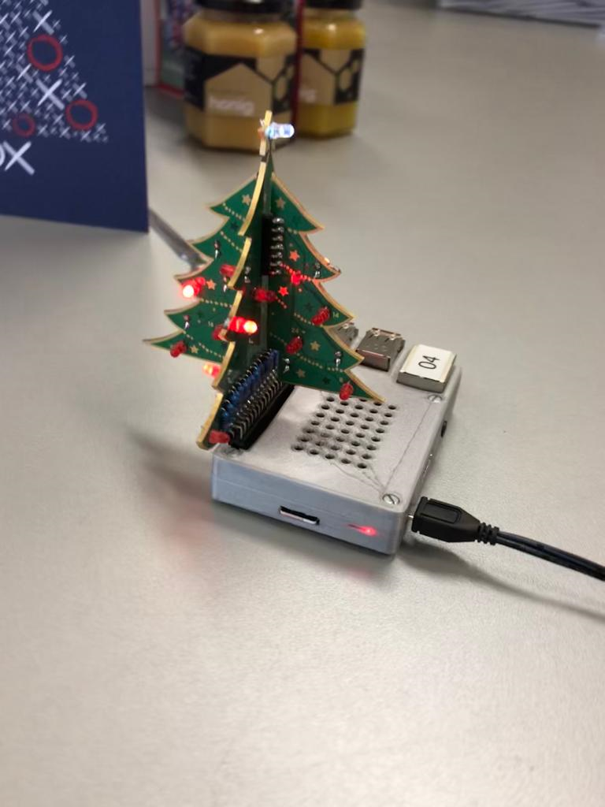

# Xmas-Tree

Auf Wunsch von Horst habe ich mich mit diesem Projekt auseinander gesetzt. 




## Was ist die Idee?

- Gemäs Datum leuchten dementsprechend viele Lampen
(am ersten eine, am 2. zwei, usw.)

- Die Lampen sind auf dem Baum Nummeriert, am 1. brennt die erste, am 2. die 1. & die 2...

## Die Umsetzung
Ich bin mit Urs zusammengesessen und habe mit siener Unterstützung zwei versionen deses Scriptes geschrieben. 

__Version 1:__ Diese Version haben wir so geschrieben wie ich es gelöst hätte.

__Version 2:__ Diese Version hat Urs so gelöst wie er es lösen würde. 
[Link](https://github.com/julianbruegger/xmaastree/tree/generisch "Anderer Branch")


Als erstes Importiere ich allen benötigten Module:

```Python
from gpiozero import LEDBoard
from gpiozero.tools import random_values
from signal import pause
import datetime 
import time
```

Danach definiere ich die bestimmten Lampen, und die sleep Dauer.
In diesem falle korespondiert die 11. Lampe auf den Pin Nr. 27 
Mit ```pmw:True``` wird der Pin als besetzt angegeben. 

```python
board11 = LEDBoard(27, pwm=True)

speed = 0.9
```

Nun starten wir eine ```while True``` schleife. Dies ist in einer Art eine unendliche Schleife.

Als erstes fragen wir in dieser Schleife der aktuelle Monat und der aktuelle Tag ab. 

Auch definieren wir die Variable ``anzahl``. Mit dem ``int(day)``wird die Ausgabe von ``day`` in eine Zahl umgewandelt. 


```python
while True:
    
    now = datetime.datetime.now()
    day = now.strftime('%d')
    month = now.strftime('%m')
    anzahl = int(day)
```

Dann begint der einfache teil des Ganzen.

Wir Prüfen nun welches der aktuelle Monat ist, fals dies nicht der Dezember ist, wird eine Errormeldung ausgegeben und das Programm abgebrochen. 

```python
if month != '12':
        print 'Es ist NICHT Dezember. Julians Weihnachtsbaum leuchtet nur im Dezember'
        break
```

Ansonnsten wird das aktuelle Datum abgefragt, je nach Tag gibt es dann ein ``elif`` wleches auf den Tag zutrifft. 

Dort werden dann als erstes alle LED's ausgeschaltet mit ``boardxx.off()``. Danach wird eine Pause gemacht, welche am Anfang definiert worden ist. Zum schluss werden dann die Entsprechenden LED's Angeschaltet mit ``boardxx.on()``
```python
elif (anzahl == 1):
    board01.off()
    time.sleep(speed)
    board01.on()
    time.sleep(speed)
```

## Reflektion

Durch die grosse Unterstützung von Urs konnte ich das Projekt relativ einfach umsetzen. 
Ich konnte im vorhinein zwar schon LED's ansteuern, und auch das aktuelle datum ausgeben. Da dies aber eines der ersten "Programierprojekte" war wusste ich noch nicht wie welche Funktionen anwenden kann und wo bzw. wie ich Googeln muss.
Die Hilfe von Urs hat viel zum allgemeinen verstehen von Python beigetragen. 
Nun behersche ich die Grundlagen von Python und weis auch wie ich bei Problemen googlen muss. Das Projekt hat mit trotz Problemen viel Freude bereitet. 

### Python
Ich hatte schon einfache kentnisse von Python, wusste aber noch nicht wie ich diese genau einsetzen muss. 

Neu war merheitlich folgendes:
- Python Module welche zusätzliche Funktionen einbinden können. 
- Python nimmt es sehr genau wenn es um Leerschläge oder Tabs geht. 
- Ansteuerung der LED's
- Verschachtelung von mehreren funktionen. 

### Nummerierung
Ein Problem welches auftrat ist, das wir anfänglich nicht merkten das die LED's auf dem Baum nicht der Nummerierung in Python entsprachen. 
Erst als Horst mich darauf aufmerksam machte, bemerkte ich den Fehler. 
Somit mussten wir für jede einzelne LED die Software & Hardware Nummer herausfinden. 

Dafür habe ich mir ein kleines [Programm](./mapping_Test.py) erstellt. 
Dieses läst jede LED für einige Sekunden aufleuchten und man kann somit die LED Position herausfinden.


